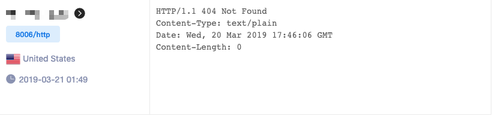
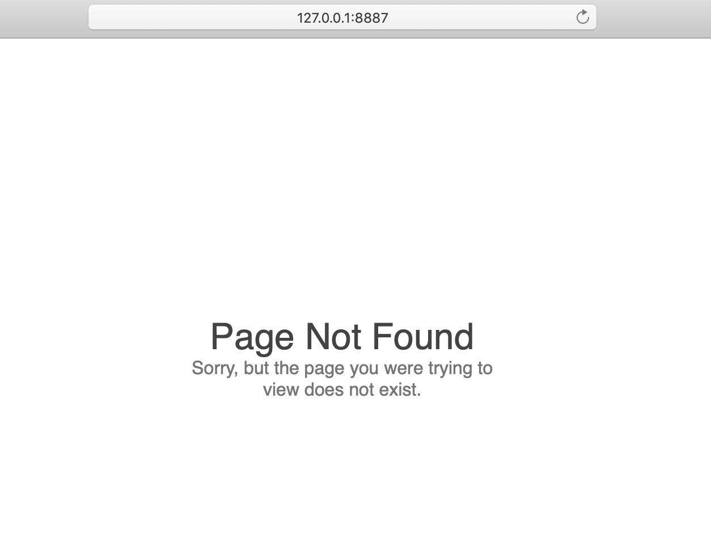

# Cobalt strike custom 404 page

## why use this?

You can find the CS service through 404 pages.

Just like:
```
https://www.zoomeye.org/searchResult?q=%22HTTP%2F1.1+404+Not+Found+++Content-Type%3A+text%2Fplain+Date%3A%22+%2B%22Content-Length%3A+0%22+-Connection
```



So, we need custom 404.


## how to use?

Open cobaltstrike.jar with rar, and replace `cloudstrike\WebServer.class` with `WebServer.class`.

Then put a 404.html to `resources` folder。

## Test

